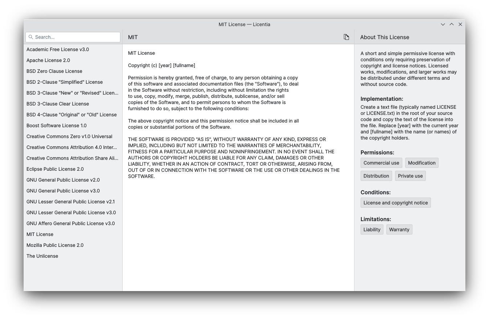

<!--
    SPDX-FileCopyrightText: 2022 Felipe Kinoshita <kinofhek@gmail.cmo>
    SPDX-License-Identifier: CC0-1.0
-->

# Licentia

Choose a license for your project



Licentia helps you choose a license for your project, it allows you to check the license's permissions, conditions and limitations, how to add said license to your project and read the full license.

## Build Flatpak

To build a flatpak bundle of Licentia use the following instructions:

```bash
$ git clone https://invent.kde.org/fhek/licentia.git
$ cd licentia
$ flatpak-builder --repo=repo build-dir --force-clean org.kde.licentia.json --install-deps-from=flathub
$ flatpak build-bundle repo licentia.flatpak org.kde.licentia
```

Now you can either double-click the `licentia.flatpak` file to open it with
some app store (discover, gnome-software, etc...) or run:

```bash
$ flatpak install licentia.flatpak
```
